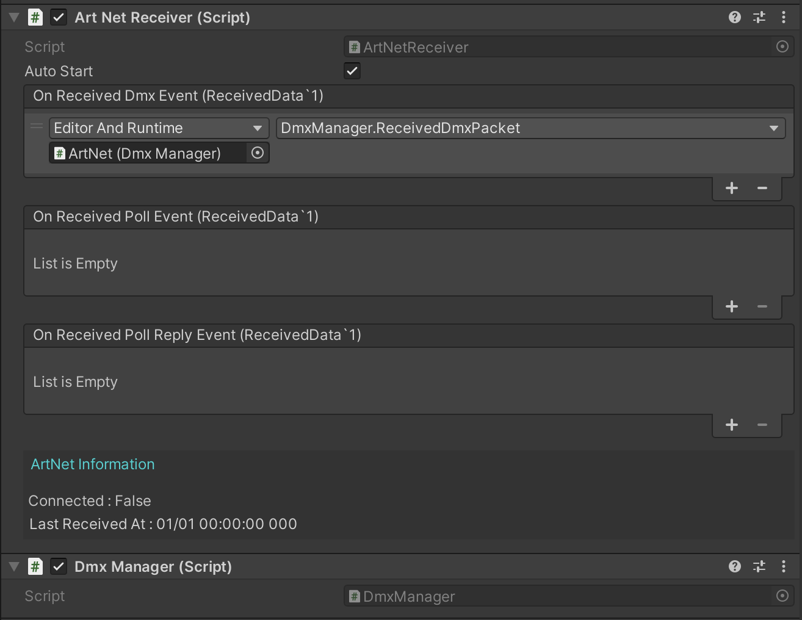

# ArtNet-Unity

A tool to receive ArtNet in Unity(C#). You can receive ArtNet packets and process the received data from the callback.

You can check the status of ArtNet reception from the editor extension. You can also save and send the received packets.

[日本語](./README_ja.md)


## Install

You can install it with Unity Package Manager.

1. Open `Window` > `Package Manager` in Unity.
2. Click the `+` button and select `Add package from git URL`.
3. Enter the following URL and click the `Add` button.

```
https://github.com/nasshu2916/ArtNet-Unity.git?path=/Assets/ArtNet#master
```

> [!NOTE]
> Unity 2021.3.1 or later is required.

## Usage



1. Add `ArtNet` prefab to your scene or `ArtNetReceiver` to GameObject.
2. set your script to `ArtNetReceiver`'s callback property. (select `Editor or Runtime`)
3. start `ArtNetReceiver`'s `autoStart` property or call `StartReceive` method.

## Support OpCode

- OpPoll
- OpPollReply
- OpDmx

## Editor Extension
### ArtNetTester

An editor extension to check the status of ArtNet reception without running the game. When the window is displayed, ArtNet packets are not received, so press the `Start Receive ArtNet Packet` button to start receiving.

You can check the time of the last ArtNet packet received and the contents of the OP Code. You can also check the last received DMX value per Universe.

### DmxRecorder

An editor extension that allows you to save and send ArtNet packets without running the game.

#### Recorder Tab

You can save receivable ArtNet packets as binary data.

Specify the output file name and folder, and press the `Start` button to save the received ArtNet packets. If a file with the same name already exists, it will be overwritten automatically.

#### Sender Tab

You can send the file saved by the Recorder.

Specify the destination IP address and press the `Start` button to send the ArtNet packets to the specified IP address.
And, You can also configure the following settings:

- Whether to send in a loop
- Whether to use the same Sequence when saving
- Sending speed

### DmxManagerViewer

An editor extension for checking the DMX values managed by DmxManager Class. This editor extension is only available when the game is running.


## Test Software

- QLC+
- MagicQ
- dot2 on PC
