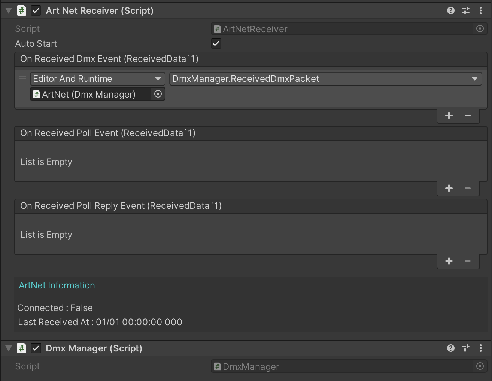

# ArtNet-Unity

A tool to receive ArtNet in Unity(C#).

This library allows you to handle ArtNet in Unity(C#).
It includes an editor extension for checking the status of ArtNet reception and saving and sending ArtNet DMX packets without running the game.


[日本語](./README_ja.md)


https://github.com/nasshu2916/ArtNet-Unity/assets/13119954/36851801-4f0a-4a2a-98aa-0b4659588a59

## Install

You can install it with Unity Package Manager.

1. Open `Window` > `Package Manager` in Unity.
2. Click the `+` button and select `Add package from git URL`.
3. Enter the following URL and click the `Add` button.

```
https://github.com/nasshu2916/ArtNet-Unity.git?path=/Assets/ArtNet#master
```

> [!NOTE]
> Unity 2021.3.1(C# 9) or later is required.

## Usage



1. Add `ArtNet` prefab to your scene or `ArtNetReceiver` to GameObject.
2. set your script to `ArtNetReceiver`'s callback property. (select `Editor or Runtime`)
3. start `ArtNetReceiver`'s `autoStart` property or call `StartReceive` method.

## Support OpCode

- OpPoll
- OpPollReply
- OpDmx

## Editor Extension
### ArtNetTester


This editor extension can check the received ArtNet status without running the editor.

When the window is displayed, ArtNet packets are not received. Therefore, you need to press the `Start Receive ArtNet Packet` button to start receiving.

You can check the time of the last ArtNet packet received and the contents of the OP Code. You can also check the last received DMX value per Universe.

### DmxRecorder

!

This editor extension can save ArtNet packets without playing the editor.

By pressing the record start button, the reception and saving of ArtNet packets will start. You can save the received ArtNet packets in Animation Clip or Binary format until you press the stop button.
The recorded Binary file is saved in a [custom format](Docs/BinaryFormat.md), and you can play the recorded ArtNet packets using the DmxPlayer.

The recorded Animation Clip can be played using the Animation component. The recorded Binary file can be played using the DmxPlayer.

### DmxPlayer


This editor extension can play recorded ArtNet packets by saved Binary file

This Editor extension can re-transmit the recorded ArtNet packets by the saved DmxRecorder Binary file.
You can loop the playback and change the playback speed.
Also, this editor extension can transmit multiple destination IP addresses and ports.

### DmxManagerViewer

An editor extension for checking the DMX values managed by DmxManager Class. This editor extension is only available when the game is running.
