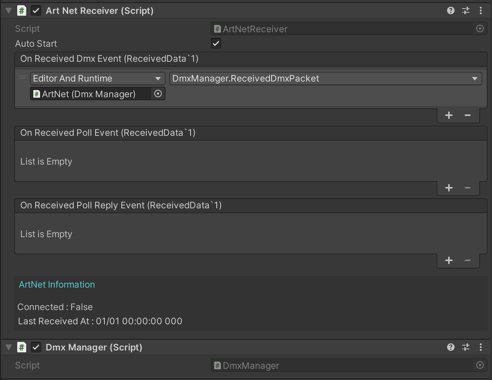

# ArtNet-Unity

Unity(C#) で ArtNet を扱うためのライブラリです。
ArtNet の受診や録画、再生が可能です。


## インストール方法

Unity Package Manager でインストールできます。

1. Unity の `Window` > `Package Manager` を開きます。
2. `+` ボタンをクリックし、`Add package from git URL` を選択します。
3. 以下の URL を入力し、`Add` ボタンをクリックします。

```
https://github.com/nasshu2916/ArtNet-Unity.git?path=/Assets/ArtNet#master
```

> [!NOTE]
> Unity 2021.3.1 以上が必要です。

## 使用方法



1. `ArtNet` プレハブをシーンに追加するか、`ArtNetReceiver` を GameObject に追加します。
2. `ArtNetReceiver` の callback プロパティに受信したデータを処理するスクリプトを設定します。
3. `ArtNetReceiver` の `autoStart` プロパティを有効にするか、`StartReceive` メソッドを呼び出します。

## Support OpCode

- OpPoll
- OpPollReply
- OpDmx

## Test Software

- QLC+
- MagicQ
- dot2 on PC
